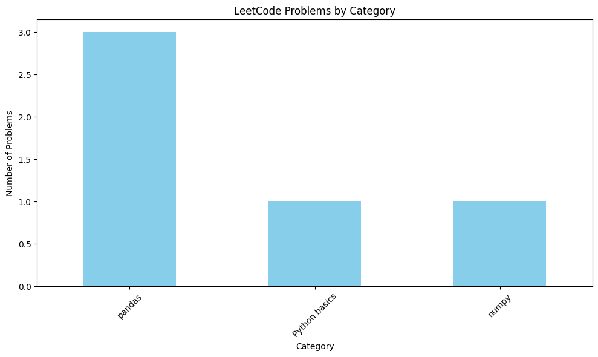
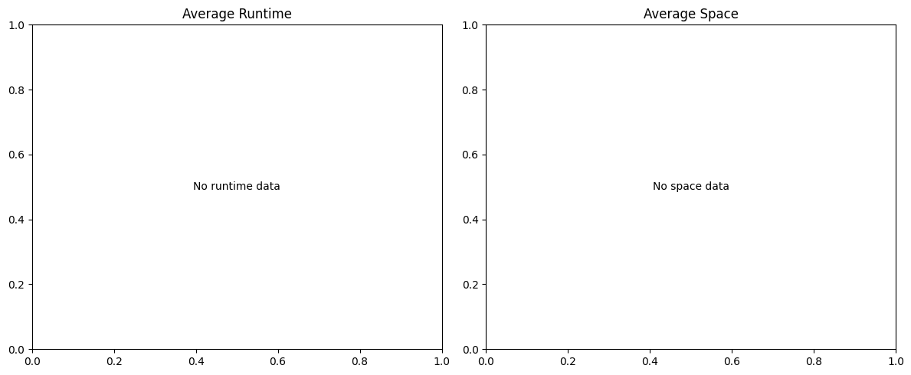

# 🚀 Daily LeetCode Practice – ML/DL Focused

Welcome to my **Daily LeetCode Practice Repository**!  
Here I solve **LeetCode problems** every day, especially those related to **Machine Learning (ML)**, **Deep Learning (DL)**, and **core Data Structures & Algorithms (DSA)** that strengthen my AI engineering skills.

#

## ⚡ Why ML/DL + LeetCode?

- 📊 **Matrix Manipulations** → Similar to **NumPy / Tensor operations**.  
- 🔗 **Graph Problems** → Core for **Graph Neural Networks (GNNs)**.  
- 🎲 **Probability & Combinatorics** → Strong foundation for **ML algorithms**.  
- 🔄 **Dynamic Programming** → Used in **sequence models (RNNs, Transformers)**.  

By solving DSA problems, I’m strengthening the **computational thinking** needed in **AI projects**.

---

## 📊 LeetCode Practice Statistics

*Last updated: 2025-08-31 09:18:00*

### 📋 Problems Summary

| Category | Problem | Runtime (s) | Space (MB) |
|----------|---------|-------------|------------|
| **[Python basics](Python basics)** | | | |
| | [0001-two-sum](Python basics\0001-two-sum\0001-two-sum.py) | N/A | N/A |
| **[numpy](numpy)** | | | |
| | [0048-rotate-image](numpy\0048-rotate-image\0048-rotate-image.py) | N/A | N/A |
| **[others](others)** | | | |
| | [0238-product-of-array-except-self](others\0238-product-of-array-except-self\0238-product-of-array-except-self.py) | N/A | N/A |
| **[0238-product-of-array-except-self](0238-product-of-array-except-self)** | | | |
| | [0238-product-of-array-except-self](others/0238-product-of-array-except-self\0238-product-of-array-except-self.py) | N/A | N/A |
| **[pandas](pandas)** | | | |
| | [0175-combine-two-tables](pandas\0175-combine-two-tables\0175-combine-two-tables.py) | N/A | N/A |
| | [0178-rank-scores](pandas\0178-rank-scores\0178-rank-scores.py) | N/A | N/A |
| | [0184-department-highest-salary](pandas\0184-department-highest-salary\0184-department-highest-salary.py) | N/A | N/A |

### 📈 Activity Overview

### 🎯 Performance Metrics

---
*Statistics generated automatically by GitHub Actions*

## 📋 Problems Summary

| Category | Problem | Runtime (s) | Space (MB) |
|----------|---------|-------------|------------|
| **[Python basics](Python basics)** | | | |
| | [0001-two-sum](Python basics\0001-two-sum\0001-two-sum.py) | N/A | N/A |
| **[numpy](numpy)** | | | |
| | [0048-rotate-image](numpy\0048-rotate-image\0048-rotate-image.py) | N/A | N/A |
| **[others](others)** | | | |
| | [0238-product-of-array-except-self](others\0238-product-of-array-except-self\0238-product-of-array-except-self.py) | N/A | N/A |
| **[0238-product-of-array-except-self](0238-product-of-array-except-self)** | | | |
| | [0238-product-of-array-except-self](others/0238-product-of-array-except-self\0238-product-of-array-except-self.py) | N/A | N/A |
| **[pandas](pandas)** | | | |
| | [0175-combine-two-tables](pandas\0175-combine-two-tables\0175-combine-two-tables.py) | N/A | N/A |
| | [0178-rank-scores](pandas\0178-rank-scores\0178-rank-scores.py) | N/A | N/A |
| | [0184-department-highest-salary](pandas\0184-department-highest-salary\0184-department-highest-salary.py) | N/A | N/A |

### 📈 Activity Overview

### 🎯 Performance Metrics

---
*Statistics generated automatically by GitHub Actions*

## 📋 Problems Summary

| Folder | Problem | Runtime (s) | Space (MB) |
|--------|---------|-------------|------------|
| [Python basics](Python basics) | [0001-two-sum](Python basics\0001-two-sum\0001-two-sum.py) | N/A | N/A |
| [numpy](numpy) | [0048-rotate-image](numpy\0048-rotate-image\0048-rotate-image.py) | N/A | N/A |
| [others](others) | [0238-product-of-array-except-self](others\0238-product-of-array-except-self\0238-product-of-array-except-self.py) | N/A | N/A |
| [0238-product-of-array-except-self](0238-product-of-array-except-self) | [0238-product-of-array-except-self](others/0238-product-of-array-except-self\0238-product-of-array-except-self.py) | N/A | N/A |
| [pandas](pandas) | [0175-combine-two-tables](pandas\0175-combine-two-tables\0175-combine-two-tables.py) | N/A | N/A |
| [pandas](pandas) | [0178-rank-scores](pandas\0178-rank-scores\0178-rank-scores.py) | N/A | N/A |
| [pandas](pandas) | [0184-department-highest-salary](pandas\0184-department-highest-salary\0184-department-highest-salary.py) | N/A | N/A |

### 📈 Activity Overview

### 🎯 Performance Metrics

---
*Statistics generated automatically by GitHub Actions*

## 📋 Problems Summary

| Folder | Problem | Runtime (s) | Space (MB) |
|--------|---------|-------------|------------|
| [Python basics](Python basics) | [0001-two-sum](Python basics\0001-two-sum\0001-two-sum.py) | N/A | N/A |
| [numpy](numpy) | [0048-rotate-image](numpy\0048-rotate-image\0048-rotate-image.py) | N/A | N/A |
| [pandas](pandas) | [0175-combine-two-tables](pandas\0175-combine-two-tables\0175-combine-two-tables.py) | N/A | N/A |
| [pandas](pandas) | [0178-rank-scores](pandas\0178-rank-scores\0178-rank-scores.py) | N/A | N/A |
| [pandas](pandas) | [0184-department-highest-salary](pandas\0184-department-highest-salary\0184-department-highest-salary.py) | N/A | N/A |

### 📈 Activity Overview

### 🎯 Performance Metrics

---
*Statistics generated automatically by GitHub Actions*

## 📋 Problems Summary

| Folder | Problem | Runtime (s) | Space (MB) |
|--------|---------|-------------|------------|
| [numpy](numpy) | [0048-rotate-image](numpy\0048-rotate-image\0048-rotate-image.py) | N/A | N/A |

### 📈 Activity Overview

### 🎯 Performance Metrics

---
*Statistics generated automatically by GitHub Actions*

## 📆 Daily Routine

✅ Solve **1–2 problems daily**.  
✅ Push solutions with **detailed explanations** in `README.md` under each problem folder.  
✅ Update **`problem_mapping.json`** for easy tracking.  

---

## 🚀 Tech Stack

- **Python 3.x**  
- **NumPy / Pandas (where relevant)**  
- **Jupyter Notebook (for explanations)**  
- **Markdown for Documentation**  

---

## 🏆 Progress Tracking

- 📅 Start Date: **[Your Date Here]**  
- 🔢 Total Problems Solved: **X**  
- 🎯 Goal: **Consistency over Speed**  

---

## 🤝 Contribution

If you’re also practicing **ML/DL + DSA**, feel free to:

- ⭐ **Star this repo**  
- 🍴 **Fork and solve with me**  
- 📝 **Suggest improvements via Pull Requests**  

---

## 📬 Connect With Me

- 💼 LinkedIn: [Your Profile Link]  
- 🐙 GitHub: [Your GitHub Profile Link]  
- ✉️ Email: [Your Email]  
